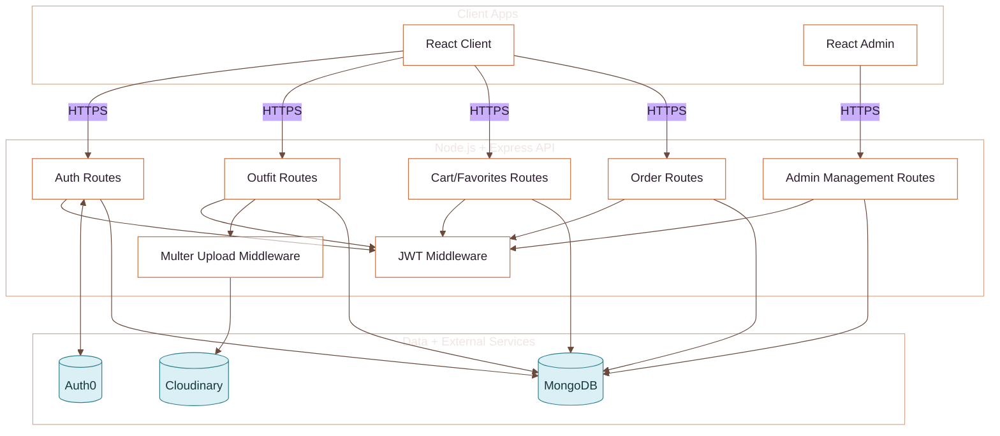
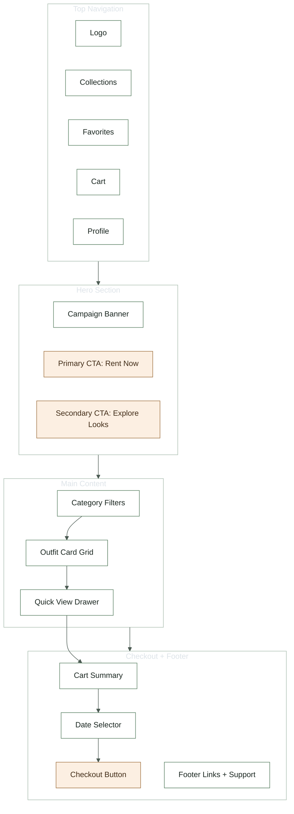

# outfits_of_joy

## Figma Design Link  
[OutfitsOfJoy Figma Design](https://www.figma.com/design/Ccb55yT6IzEFeFS8JaOTdJ/RENT-CLOTHES?node-id=0-1&t=saeITUgTOqgkmeV7-1)

## Postman Documentation Link  
[API Documentation Link](https://documenter.getpostman.com/view/53356188/2sBXijJrNc)

Outfits of Joy is a **clothing rental website** that allows users to rent fashionable outfits for various occasions. The platform provides a seamless experience for users to browse, favorite, add to cart, and rent clothes. It also includes dedicated sections for collections, orders, and detailed views of each clothing item.

## User Flow Diagram

```mermaid
%%{init: {
  "theme": "base",
  "themeVariables": {
    "fontFamily": "Poppins, Segoe UI, sans-serif",
    "primaryColor": "#5B8DEF22",
    "primaryTextColor": "#16324F",
    "primaryBorderColor": "#5B8DEF",
    "lineColor": "#3F5C7A",
    "tertiaryColor": "#7FD1B922",
    "clusterBkg": "#FFFFFF66",
    "clusterBorder": "#9CB3C9"
  }
}}%%
flowchart LR
    A([Landing Page]) --> B{User Auth}
    B -->|New User| C[Sign Up]
    B -->|Returning User| D[Login]
    C --> E[Home]
    D --> E[Home]

    E --> F[Browse Collections]
    F --> G[Outfit Details]
    G --> H[Select Rental Dates]
    H --> I{Action}
    I -->|Add to Favorites| J[Favorites]
    I -->|Add to Cart| K[Cart]
    K --> L[Checkout]
    L --> M[Place Order]
    M --> N[Orders/Tracking]
    E --> O[Profile]
    O --> P[Address + Account Settings]

    classDef surface fill:#FFFFFF99,stroke:#5B8DEF,stroke-width:1px,color:#16324F;
    classDef action fill:#7FD1B947,stroke:#2F8F78,stroke-width:1px,color:#123B32;
    class A,E,F,G,H,J,K,L,M,N,O,P surface;
    class B,I,C,D action;
```

## Backend Architecture & Data Flow

## High-Level UI Wireframe

---

## Features

- **User Authentication**:
  - Users can register, log in, and manage their profiles.
  
- **Clothing Collections**:
  - Dedicated collections for different types of clothing (e.g., Sherwani, Tuxedo, lehenga etc).

- **Cloth Details**:
  - Each clothing item displays details such as:
    - Rent price
    - MRP (Maximum Retail Price)
    - Deposit amount
    - Select Date to rent

- **User Cart**:
  - Users can add clothes to their cart for renting.
  - Manage cart items (update quantity, remove items).

- **Favorites**:
  - Users can save their favorite clothes for future reference.

- **Order Section**:
  - Users can view their rental history and track current orders.

- **Admin Panel**:
  - Admins can add, update, or remove clothing items.
  - Manage user orders and collections.

---

## Technologies Used

- **Frontend**:
  - **React**: Frontend library for UI development.
  - **Auth0**: For secure user authentication.
  - **React Toastify**: For showing user-friendly notifications.
  - **React Router DOM**: For navigation and routing.
  - **Axios**: For handling API requests.
  - **Tailwind CSS**: For styling.

- **Backend**:
  - **Node.js**: JavaScript runtime for building the server.
  - **Express.js**: Web framework for designing server routes.
  - **MongoDB**: NoSQL database for storing user, clothing, and order data.
  - **JWT (JSON Web Tokens)**: Used for authentication and session management.
  - **Cloudinary**: For storing and managing images of clothing items.
  - **Multer**: Middleware for handling file uploads.

- **Other Tools**:
  - **Postman**: For testing API endpoints.
  - **Git**: For version control.

